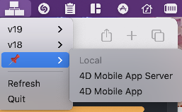

# 4d-link-status-bar

[![release][release-shield]][release-url]

 Status menu bar to open `4DLink` from Favorites vXX folders: Local + Remote

ie. reproduce the [Open Recent Databases menu](https://doc.4d.com/4Dv18R6/4D/18-R6/Connecting-to-a-4D-Server-Database.300-5360760.en.html) of 4D but for all versions and without an already opened 4D app

## Start at login?

Go to system preferences, `User & Groups`, select your user and the `Login Items` tab. Add here the app with `+`

## Custom bookmarks

If you want to keep forever some projects, and not use 4D recents one, create a folder `Favorites XXX` in `$HOME/Library/Application Support/4D`.

For instance `Favorites 📌` or `Favorites Bookmarks`.

then put your `4DLink` files into one of possible subfolder `Local` or `Remote`

<!-- MARKDOWN LINKS & IMAGES -->
<!-- https://www.markdownguide.org/basic-syntax/#reference-style-links -->
[release-shield]: https://img.shields.io/github/v/release/mesopelagique/4d-link-status-bar
[release-url]: https://github.com/mesopelagique/4d-link-status-bar/releases/latest
